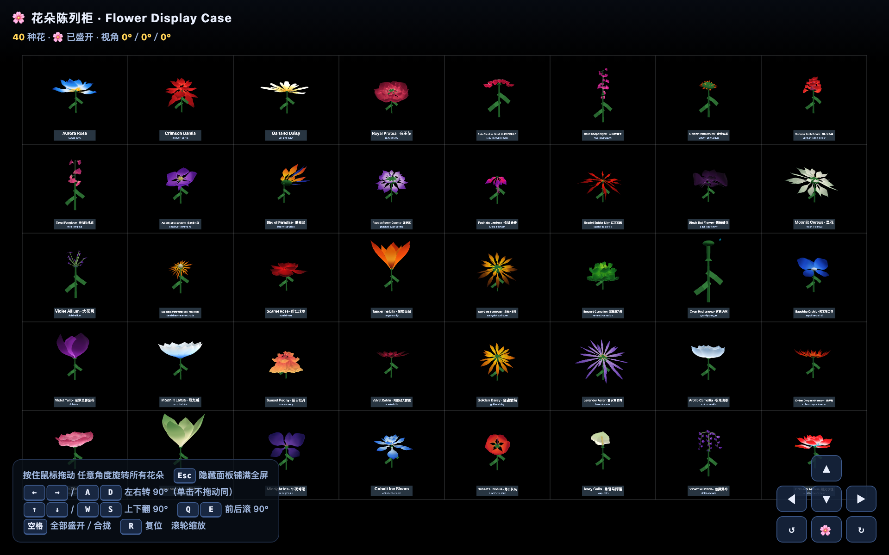
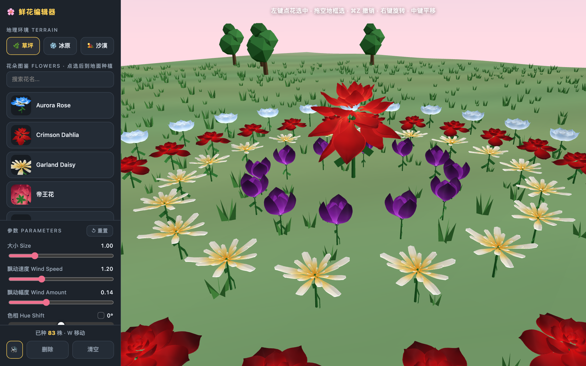
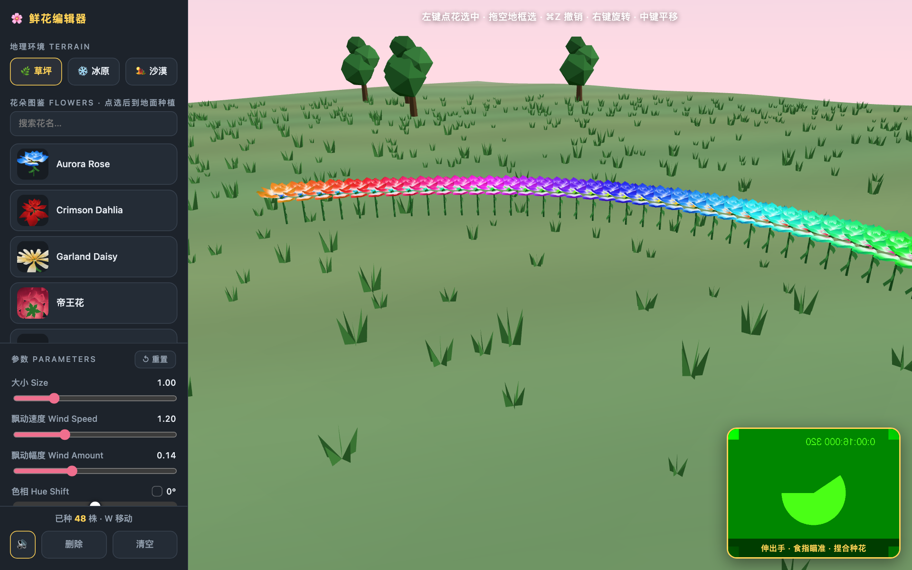
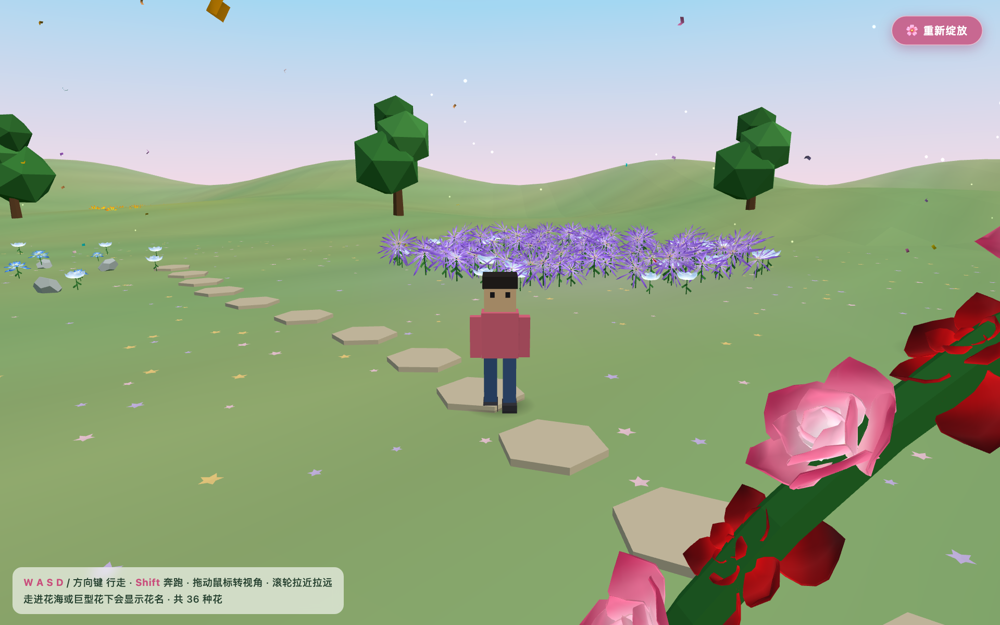
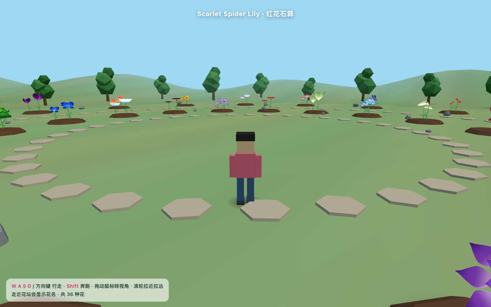

# 🌸 Flower-HUA · 程序化花朵六件套

同一套程序化花朵引擎，六种玩法。每个页面都是**单文件 HTML**——点开即用，无需安装、无需构建、无需联网。

**🔗 在线预览：https://vr-jobs.github.io/Flower-HUA/**

One procedural flower engine, six ways to play with it. Every page is a single self-contained HTML file — no install, no build step, no network.

---

## 六个项目 · The six

| | 项目 | 截图 | 云端预览 | 文件 | 大小 |
|---|---|---|---|---|---|
| 🗂 | **花朵陈列柜** Display Case |  | [打开](https://vr-jobs.github.io/Flower-HUA/demos/display-case.html) | [`demos/display-case.html`](demos/display-case.html) | 2.4 MB |
| 🎨 | **鲜花编辑器** Flower Editor（轻量版） |  | [打开](https://vr-jobs.github.io/Flower-HUA/demos/flower-editor-lite.html) | [`demos/flower-editor-lite.html`](demos/flower-editor-lite.html) | 2.8 MB |
| 🖐 | **鲜花编辑器** 完整版（含 AR 手势） |  | [打开](https://vr-jobs.github.io/Flower-HUA/demos/flower-editor.html) | [`demos/flower-editor.html`](demos/flower-editor.html) | 29 MB |
| 🌈 | **鲜花世界** Flower World |  | [打开](https://vr-jobs.github.io/Flower-HUA/demos/flower-world.html) | [`demos/flower-world.html`](demos/flower-world.html) | 2.5 MB |
| 🚶 | **花园漫游** Garden Walk |  | [打开](https://vr-jobs.github.io/Flower-HUA/demos/garden-walk.html) | [`demos/garden-walk.html`](demos/garden-walk.html) | 2.4 MB |
| 🖼 | **花朵画廊** Gallery |  | [打开](https://vr-jobs.github.io/Flower-HUA/demos/gallery.html) | [`demos/gallery.html`](demos/gallery.html) | 2.4 MB |
| 🛠 | **Flower Studio** 完整工作台 |  | [打开](https://vr-jobs.github.io/Flower-HUA/demos/flower-studio.html) | [`demos/flower-studio.html`](demos/flower-studio.html) | 45 MB |

> ⚠️ 完整版编辑器（29 MB）和 Flower Studio（45 MB）体积较大，在线打开需要等待较长时间。建议**下载后本地双击运行**。

---

## 🗂 花朵陈列柜 · Display Case

40 种花各占一格的接触印相表。转的是**看每朵花的角度**，不是看柜子的角度——所以任何朝向都不会有空格或互相遮挡。

| 操作 | 行为 |
|---|---|
| **按住鼠标拖动** | 任意角度旋转全部花朵 |
| `←` `→` / `A` `D` / 单击 | 左右转 90° |
| `↑` `↓` / `W` `S` | 上下翻 90° |
| `Q` `E` | 前后滚 90° |
| `空格` | 全部一起盛开，再按一次一起合拢 |
| `Esc` | 隐藏所有面板，格子铺满整屏 |
| `R` / 滚轮 | 复位 / 缩放 |

风力晃动幅度默认调大，方便观察花瓣动态。

## 🎨 鲜花编辑器 · Flower Editor

| 操作 | 行为 |
|---|---|
| 左键点击 | 种植 / 选中花朵 |
| 左键拖空地 | 框选 |
| 右键拖动 / 中键拖动 | 旋转视角 / 平移视角 |
| `W` `E` `R` | 移动 / 缩放 / 旋转 gizmo |
| `⌘Z` `⌘C` `⌘V` `⌘A` | 撤销 / 复制 / 粘贴 / 全选 |
| `1`–`9` / `B` | 快速选花 / 批量种植 |

- **三种地形**：草坪 · 冰原 · 沙漠
- **39 种花**全部可种，带缩略图与搜索
- **批量种植**：数量 / 形状（圆盘·圆环·网格·散布）/ 半径 / 随机度，圆圈内实时预览
- **画笔连种**：按住拖动画一条花径（与批量互斥）
- **14 种画风**：水彩 · 日系动画 · 童话绘本 · 黑白漫画 · 美式漫画 · 像素 · 赛博霓虹 · 黑色电影 · 铜板雕刻 · 白底线稿 · 黑底粉笔 · 鎏金线稿 · 梦境放射
- **存档**：自动保存 · 导出/导入 JSON · 压进链接分享
- **模式**：漫游 · 生长回放 · 演奏 · 音乐花园 · AR 手势种花 · 俯视 · 照片导出
- **清空** = 全量归零：清花 + 参数 + 画风 + 昼夜 + 所有开关（只保留地形）

> 🖐 **AR 手势种花只在完整版里，且必须用 Chrome 打开**——Safari 不允许 `file://` 页面访问摄像头。

## 🌈 鲜花世界 · Flower World

上千朵花铺满的花海：百花曼陀罗、花拱门、混植花境、巨型花束丘、名花专区。第一人称走进花下。

## 🚶 花园漫游 · Garden Walk

低多边形小人在花园散步，走近花坛显示花名。`WASD` 行走，`Shift` 奔跑，拖动鼠标转视角。

## 🖼 花朵画廊 · Gallery

36 种花逐一细看的转盘画廊，带下拉选择和 `#flower-id` 深链。

---

## 🔧 构建 · Building

`src/` 是这些页面的作者源码：每个页面一个 webpack 入口，构建器把它们打成单文件 HTML。

```bash
node src/build-flower-page.cjs grid         display-case.html
node src/build-flower-page.cjs editor       flower-editor.html
node src/build-flower-page.cjs editor-lite  flower-editor-lite.html
node src/build-flower-page.cjs world        flower-world.html
node src/build-flower-page.cjs garden       garden-walk.html
node src/build-flower-page.cjs all          gallery.html
```

`src/verify-grid.cjs` 与 `src/verify-editor.cjs` 是对应的无头浏览器验收脚本（Playwright + swiftshader）。

> ⚠️ **构建需要 Flower-HUA Studio 源码树**（入口文件 `import` 自 `../../Studio/components/flower/`），本仓库未包含。这里放源码是为了让实现可读、可审阅，不是一个开箱即用的构建。

---

## 🌱 源起与致谢 · Origin & Credits

本项目的花朵引擎，源自 **whitecat-captain/bloom-animation**。

> Upstream: https://github.com/whitecat-captain/bloom-animation

**关于许可证**：上游仓库**未声明任何开源许可证**。因此本仓库也没有附带 LICENSE 文件——在上游作者明确授权之前，转载、修改与再分发的条款处于未定状态。如果你打算在自己的项目里使用，请先联系上游作者。
